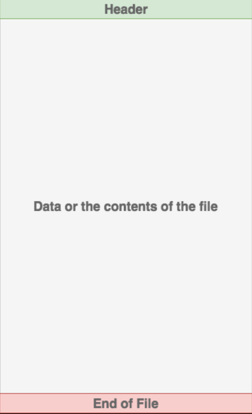

# Reading and Writing Files in Python

## What is a file?

a file is a contiguous set of bytes use to store data.
the data is organized in specific format and can be anything as simple as text file or as complicated as executable program.  
at the end,these files are translated into 0 and 1 so the computer can easily process them

Files in modern file system is composed from 3 main parts:
1- Header: meta data about the content of the file(file name, file size,file type,etc)
2- Data: content of the file as written by the creator ot the editor
3- End of file: a special character that indicates the end of the file 

### File Path:

File path is a string that represents the location of the file , it's broken up into three parts:  
1- ***folder path***  : file folder path location in the file system separated by backslash (/)
2- **file name**: the actual name of the file  
3-***extension***: the end of the file path pre-pended by a period(.) used to indicated the file type

# thing I want to learn about:
1- can files provide better features than data bases 
2- is there problems related to the using of the files
3- what is best cases to use a file system