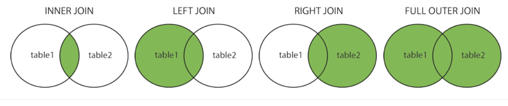
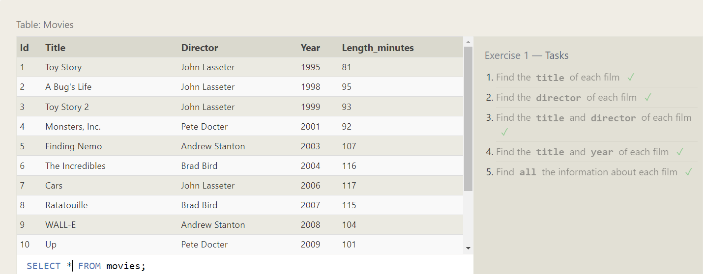

# Structured Query Language (SQL)

### **SQL SELECT STATEMNT**
The <span style="color:red; font-weight:900">SELECT</span>  statement is used to select data from a database.

The data returned is stored in a result table, called the result-set.


<span style="color:green; font-weight:700">SELECT syntax</span> 
```html 
SELECT column1, column2, ...
FROM table_name;
```
<br>

### **SQL UPDATE Statement**
The  <span style="color:red; font-weight:900">UPDATE</span> statement is used to modify the existing records in a table.

<span style="color:green; font-weight:700">UPDATE syntax</span> 
```html
UPDATE table_name
SET column1 = value1, column2 = value2, ...
WHERE condition;

```
 
### **SQL DELETE Statement**
The  <span style="color:red; font-weight:900">DELETE</span> statement is used to delete existing records in a table.

<span style="color:green; font-weight:700">DELETE syntax</span> 
```html 
DELETE FROM table_name WHERE condition;

```
### **INSERT INTO Statement**

The <span style="color:red; font-weight:900">INSERT INTO</span> statement is used to insert new records in a table.

<span style="color:green; font-weight:700">INSERT INTO syntax</span> 
```html
INSERT INTO table_name (column1, column2, column3, ...)
VALUES (value1, value2, value3, ...);

```
### **SQL CREATE TABLE Statement**
The The <span style="color:red; font-weight:900">CREATE TABLE </span> statement is used to create a new table in a database.

<span style="color:green; font-weight:700">CREATE TABLE syntax</span> 
```html
CREATE TABLE table_name (
    column1 datatype,
    column2 datatype,
    column3 datatype,
   ....
);

```
### **SQL WHERE Clause**
The  <span style="color:red; font-weight:900">WHERE clause </span>is used to filter records.

It is used to extract only those records that fulfill a specified condition.

<span style="color:green; font-weight:700">WHERE Syntax</span> 
```html
CREATE TABLE table_name (
    column1 datatype,
    column2 datatype,
    column3 datatype,
   ....
);
```
### **SQL Wildcard Characters**
A wildcard character is used to substitute one or more characters in a string.

The <span style="color:red; font-weight:900">Wildcard characters </span> are used with the LIKE operator. The LIKE operator is used in a WHERE clause to search for a specified pattern in a column.
<br>
<br>
<br>
### **SQL INNER JOIN**
A  <span style="color:red; font-weight:900">INNER JOIN  </span>is used to combine rows from two or more tables, based on a related column between them.

<span style="color:green; font-weight:700">INNER JOIN syntax</span>  
```html
SELECT Orders.OrderID, Customers.CustomerName, Orders.OrderDate
FROM Orders
INNER JOIN Customers ON Orders.CustomerID=Customers.CustomerID;
```
<br>

### **SQL LEFT JOIN**
The   <span style="color:red; font-weight:900">LEFT JOIN  </span> keyword returns all records from the left table (table1), and the matching records from the right table (table2). The result is 0 records from the right side, if there is no match.

<span style="color:green; font-weight:700">LEFT JOIN syntax</span>  
``` html
SELECT column_name(s)
FROM table1
LEFT JOIN table2
ON table1.column_name = table2.column_name;
```
### **Right  JOIN**
The   <span style="color:red; font-weight:900">RIGHT JOIN  </span> keyword returns all records from the left table (table1), and the matching records from the right table (table2). The result is 0 records from the right side, if there is no match.

<span style="color:green; font-weight:700">RIGHT JOIN syntax</span>  
``` html
SELECT column_name(s)
FROM table1
RIGHT JOIN table2
ON table1.column_name = table2.column_name

```

  

# Exercises 



